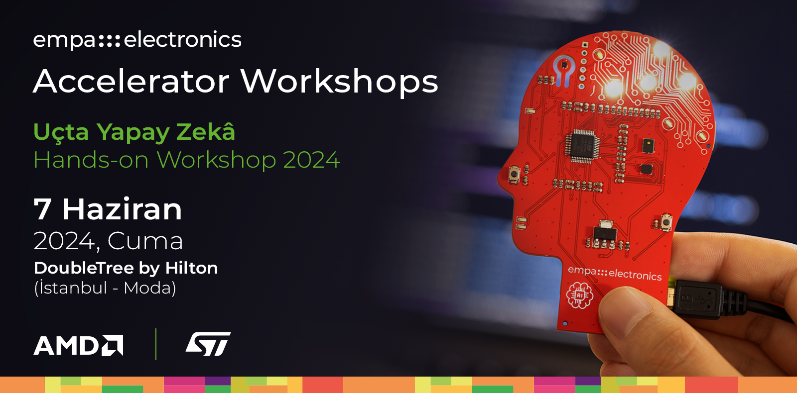

    

# 1) Vitis-AI ile FPGA Platformlarında AI Uygulamaları Geliştirme

## Çalışma Ortamı Kurulumu

Vitis-AI çözümü için gerekli Docker container ortamı kurulum adımları için AMD resmi dokümantasyonu içerisindeki adımları takip ediniz.

Kaynak: [https://xilinx.github.io/Vitis-AI/3.0/html/docs/install/install.html](https://xilinx.github.io/Vitis-AI/3.0/html/docs/install/install.html)