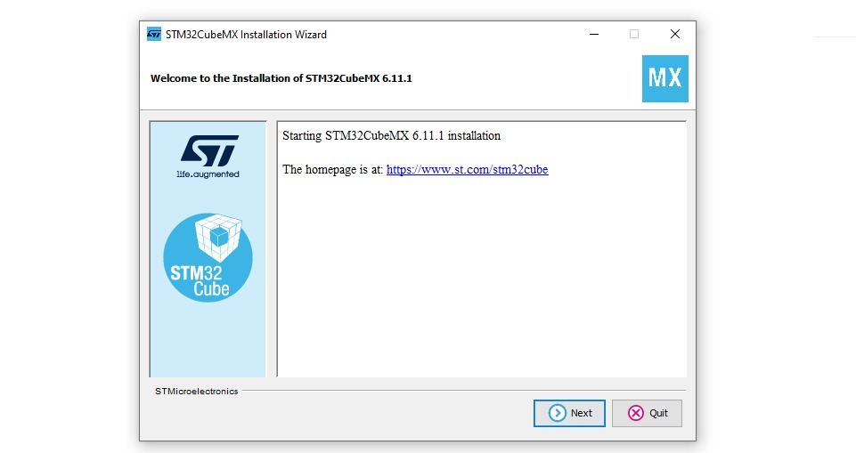
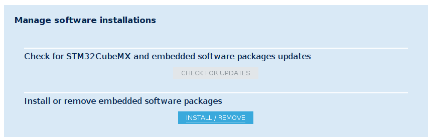
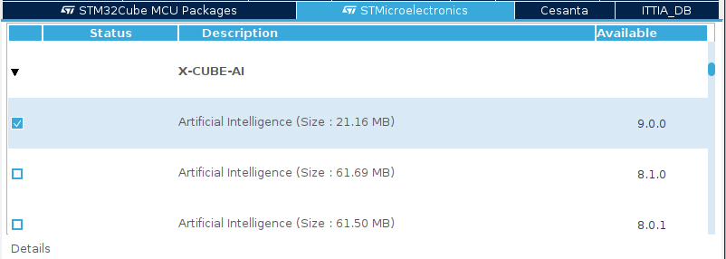
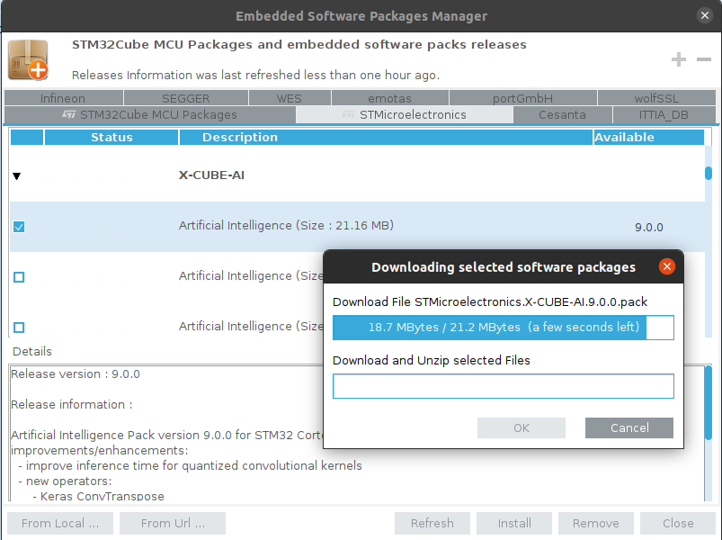

<p align="center">
    
</p>

# 2) ST Platformları İçin Edge-AI Çözümleri Geliştirme 

## Aktivite Gereksinimleri

Çalışma ortamının kurulum adımlarına geçmeden önce lütfen kurulum için tavsiye edilen doküman linklerine tıklayınız ve gerekli kurulum adımlarını takip ediniz.

- Git ([git-scm.com - Installing-Git](https://git-scm.com/book/en/v2/Getting-Started-Installing-Git))
- Workshop Repository & Python Sanal Ortamı ([Aşağıda Yönergelendirilmiştir](github.com/Empa-Teknoloji/AI_Workshop/Activity2_Bare-Metal_Edge-AI_Solution/README.md))

## Çalışma Ortamı Kurulumu
### Alternatif-1: Bulutta Çalışma Ortamı
Aktivite için oluşturulan bulut çalışma ortamı _geliştirme_ ortamı için ortam kurulumu gerektirmez (_test ortamı seri port bağlantısı için yerel çalışma ortamı gerektirir_). Aşağıdaki linke tıklayarak erişebileceğiniz Colab Notebook örneği ile aktiviteye uygulamalı katılım sağlayabilirsiniz.

1- Colab Notebook Örneği
[Accelerators Workshop - Uçta Yapay Zeka - Aktivite-2 Geliştirme İçin Bulut Çalışma Ortamı](https://colab.research.google.com/drive/1rSpHM_JGy5NAFCWkZ7TPcCt1fxc8kywF?usp=sharing)

### Alternatif-2: Yerel Çalışma Ortamı

Etkinliğimizde kullanılacak Python sanal ortamını eksiksiz şekilde edinmek için, aşağıdaki adımları kendi lokal geliştirme makinenizde (_kod bloğu olanları terminalinizde çalıştırarak_) takip ediniz.  

1- Git Kurulumu: [Git Installation Guide - git-scm.com](https://git-scm.com/book/en/v2/Getting-Started-Installing-Git)

2- Python3.10 Kurulumu: [Python Installation Guide - realpython.com](https://realpython.com/installing-python)

3- Aktivite için gerekli kaynak dosyalarının edinimi için kod deposunu kendi lokal geliştirme makinenize indiriniz:
```
git clone https://github.com/Empa-Teknoloji/AI_Workshop.git
```
4- Aktivite çalışma ortamında kullanılacak Python sanal ortamının (_virtual environment_) kurulumu:

4.1- "virtualenv" aracının kurulumu:
```
// Ubuntu için
sudo apt install virtualenv

// Windows için
pip3 install virtualenv
```
4.2- Python sanal ortamını oluşturunuz ve terminalinizde aktive ediniz:  
(Çalıştırma sonrası terminal komut satırı başlangıcında (WORKSHOP_ENV) eki görmelisiniz)
```
virtualenv WORKSHOP_ENV

// Ubuntu için
source WORKSHOP_ENV/bin/activate

// Windows için
.\WORKSHOP_ENV\Scripts\activate
```
4.3- Kod deposu klasörü içine giderek gerekli paketlerin kurulumunu yapınız:

```
cd AI_Workshop
pip3 install -r requirements.txt
```

### Ek: STM32Cube-MX ve STM32CubeAI Kurulumu  
Aktivite bünyesinde geliştirilecek çözümün (modelin) ST platformlarına implementasyonu için gerekli STM32CubeMX ve STM32CubeAI ürünlerinin kurulumu için aşağıdaki adımları takip ediniz.

**Ubuntu İçin STM32CubeMX**  
- Verilen adrese gidiniz ve STM32CubeMX-Lin satırına giderek "Get software" ve sırasıyla "Download as a Guest" butonlarını kullanarak indirme linki talebi oluşturunuz. Ardından e-mail adresinize gelen link ile indirmeyi başlatınız.  
[https://www.st.com/en/development-tools/stm32cubemx.html#get-software](https://www.st.com/en/development-tools/stm32cubemx.html#get-software)

- İndirilen sıkıştırılmış dosyayı mevcut klasör içerisine ayıklayınız.
```
sudo apt install unzip
unzip en.stm32cubemx-lin* -d stm32cubemx
```
- Ayrıştırılan klasör içerisine giderek setup için verilen dosya için uygun dosya yetkilendirmesini ayarlayınız.
```
cd stm32cubemx
sudo chmod 777 SetupSTM32CubeMX*
./SetupSTM32CubeMX*
```
- Ayrıştılan klasör içerisindeki setup dosyasını çalıştırınız.
```
./SetupSTM32CubeMX*
```
- Ardından setup dosyasının çalıştırılmasıyla açılan kurulum yönergesini ön tanımlı seçenekler ile ilerleterek kurulumu tamamlayınız.  


**Windows İçin STM32CubeMX**  
- Verilen adrese gidiniz ve STM32CubeMX-Lin satırına giderek "Get software" ve sırasıyla "Download as a Guest" butonlarını kullanarak indirme linki talebi oluşturunuz. Ardından e-mail adresinize gelen link ile indirmeyi başlatınız.  
[https://www.st.com/en/development-tools/stm32cubemx.html#get-software](https://www.st.com/en/development-tools/stm32cubemx.html#get-software)
- İndirilen sıkıştırılmış dosyayı mevcut klasör içerisine ayıklayınız.
- Ayıklanan klasör içerisindeki .exe uzantılı "SetupSTM32CubeMX..." dosyasını yönetici olarak çalıştırınız.
- Ardından setup dosyasının çalıştırılmasıyla açılan kurulum yönergesini ön tanımlı seçenekler ile ilerleterek kurulumu tamamlayınız.  


**Ubuntu & Windows İçin STM32CubeAI**  
STM32CubeMX ürünün kurulumu sonrası STM32CubeAI eklentisinin kurulması için sırasıyla:

* STM32CubeMX programını açtıktan sonra gelen arayüz içerisinde "Manage software installations" bölümünde yer alan "Install / Remove" butonuna tıklayınız.  


* Açılan mini pencere içerisinde STMicroelectronics sekmesi altındaki **"X-CUBE-AI"** paketini bularak güncel sürüm olan **"Artificial Intellicenge 9.0.0"** versiyonunu seçeerek **Install** butonu ile kurulumu başlatınız.


* Açılan pencerede ST hesabı ile oturum açma sonrası ön tanımlı değerler ile kurulumu ilerletiniz ve bitiriniz.  
