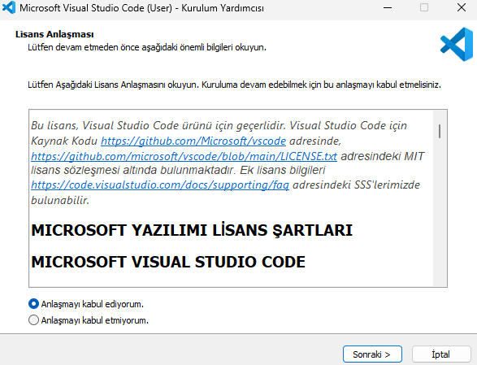
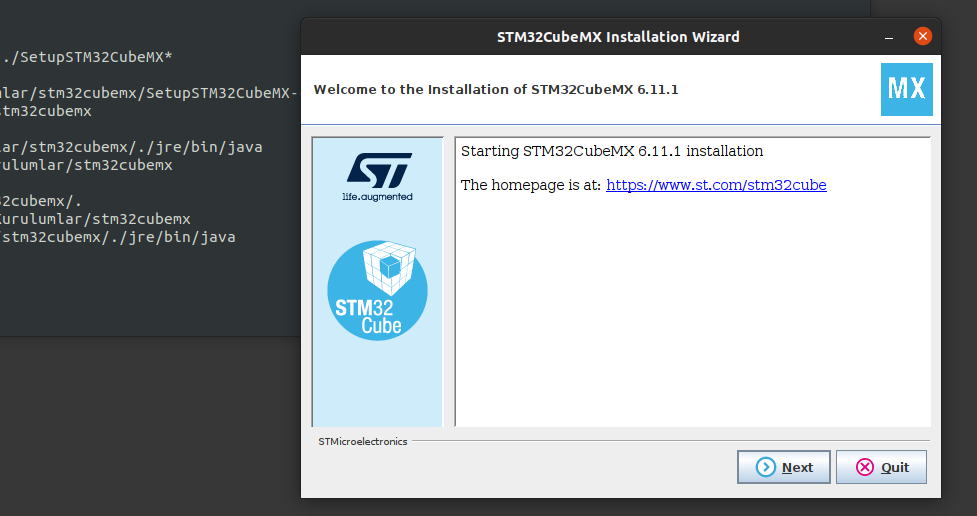

<p align="center">
    
</p>

# 2) ST Platformları İçin Edge-AI Çözümleri Geliştirme 

## Çalışma Ortamı Kurulumu
### Alternatif-1: Bulutta Çalışma Ortamı (Sadece Geliştirme)
Aktivite için oluşturulan bulut çalışma ortamı _geliştirme_ ortamı için ortam kurulumu gerektirmez. Geliştirilen çözümün testi için gerekli test ortamı seri port bağlantısı için yerel çalışma ortamı gerektirir, bulutta çalışma ortamında **kullanılamaz**. Aşağıdaki linke tıklayarak erişebileceğiniz Colab Notebook örneği ile aktivitenin _geliştirme_ adımlarına uygulamalı katılım sağlayabilirsiniz.

1- Colab Notebook Örneği  
[Accelerators Workshop - Uçta Yapay Zeka - Aktivite-2 Bulutta Geliştirme Çalışma Ortamı](https://colab.research.google.com/drive/1rSpHM_JGy5NAFCWkZ7TPcCt1fxc8kywF?usp=sharing)

### Alternatif-2: Yerel Çalışma Ortamı (Geliştirme + Test)

Etkinliğimizde kullanılacak Python sanal ortamını eksiksiz şekilde edinmek için, aşağıdaki adımları kendi lokal geliştirme makinenizde (_kod bloğu olanları terminalinizde çalıştırarak_) takip ediniz.
> Windows platformu için cmd, Powershell, Windows10 Terminal gibi komut satırı araçlarının herhangi birinden faydalanabilirsiniz.

#### Windows İçin Çalışma Ortamı Kurulumu

**1- Git Kurulumu** 

1.1. Git için verilen indirme linkini kullanarak kurulum için gerekli dosyayı indiriniz.  
[Git for Windows - Setup ](https://github.com/git-for-windows/git/releases/download/v2.45.2.windows.1/Git-2.45.2-64-bit.exe)

1.2. .exe uzantılı Git kurulum dosyasını çift tıklayarak çalıştırınız ve kurulum için açılan pencerede **Next** butonu ile sonraki ekrana geçiniz.  
 

1.3. **Next** butonu ile sırasıyla tüm ekranlarda seçili gelen değerleri kullanarak kurulumu ilerletiniz. Kurulumun en son ekranındaki **Finish** butonu ile kurulumu bitiriniz.  
**Önemli Not:** "Adjusting your PATH environment" ekranında ön tanımlı gelen değerin "_Git from the command line and and also from the 3rd-party software_" olarak seçili geldiğinden emin olunuz.  
  

**2- VSCode Kurulumu**  

2.1. VSCode Editor için verilen indirme linkini kullanarak kurulum için gerekli dosyayı indiriniz.  
[Visual Studio Code - Windows x64 Installer](https://code.visualstudio.com/sha/download?build=stable&os=win32-x64-user)

2.2. İndirilen kurulum dosyasına çift tıklayarak kurulumu başlatınız ve ilk sayfada gelen "Anlaşmayı kabul ediyorum." seçeneğini ve **Sonraki** butonu ile kurulumu ilerletiniz.  


2.3. Bir sonraki ekranda yer alan seçenekler içerisinde aşağıdaki **görselde verilen seçenekleri işaretleyiniz** ve **Sonraki** butonu ile kurulumu ilerleterek tamamlayınız.  


**3- Python3.10 Kurulumu**

3.1. Python3.10 için verilen indirme linkini kullanarak kurulum için gerekli dosyayı indiriniz.  
[Python3.10 - Windows x64 Download Link](https://www.python.org/ftp/python/3.10.10/python-3.10.10-amd64.exe)

3.2. İndirilen .exe uzantılı Python kurulum dosyasına çift tıklayarak kurulum penceresini başlatınız. Açılan pencerede **"Add Python to PATH"** seçeneğini seçili hale getirdikten sonra **"Install Now"** başlığına tıklayarak Python kurulumunu ilerletiniz.    


3.3. "Setup was succesful" ibaresi ile gelen pencere sonrasında Python için son adım olan "Disable path lenght limit" yazısına tıklayınız ve gelen uyarıyı onayladıktan sonra Close butonuna basarak kurulumu bitiriniz.


**4- Kod Deposu (Repository) İçeriklerinin İndirilmesi**  
Aktivite için gerekli kaynak dosyalarının edinimi için kod deposunu **aşağıda verilen komutları terminalinizde çalıştırarak** kendi yerel geliştirme makinenize indiriniz.
> **Önemli Not**: Terminal komut satırı kullanım kolaylığı sağlamak ve kurulumların doğru bir şekilde yürütülebilmesi için C: > Users(Kullanıcılar) > "Kullanıcı-Adı" konumunda açılmalı ve verilen komutlar bu dosya yolunda çalıştırılmalıdır. Bir komut satırı aracı, arama kısmına adı yazılarak başlatıldığında bu dosya yolunda başlatılmakta ve oluşturacağınız klasörler/dosyalar bu klasör altında listelenmektedir. _Örnek ideal terminal başlangıç satırı: "C:/Users/empa"_
```
mkdir Workshop_Workspace && cd Workshop_Workspace
git clone https://github.com/Empa-Teknoloji/AI_Workshop.git
```  


**5- Python Sanal Ortamı (Virtual Environment) Kurulumu**  
Aktivite çalışma ortamında kullanılacak Python sanal ortamının (_virtual environment_) kurulumu için verilen adımları takip ediniz.

5.1. "virtualenv" aracının kurulumu için verilen komutu terminalinizde çalıştırınız:
```
pip3 install virtualenv
```  


5.2. Python sanal ortamını oluşturunuz ve terminalinizde aktive ediniz. İkinci komutun çalıştırılması sonrası terminal komut satırı başlangıcında (WORKSHOP_ENV) eki görmelisiniz.
```
virtualenv WORKSHOP_ENV --python=python3.10
```
```
.\WORKSHOP_ENV\Scripts\activate
```
5.3. Kod deposu klasörü içine giderek gerekli paketlerin kurulumunu yapınız:

```
cd AI_Workshop
pip3 install -r Activity2_Bare-Metal_Edge-AI_Solution/requirements.txt
```
  
**6- Windows İçin STM32CubeMX & STM32CubeAI**  

Aktivite içeriğinde geliştirilecek çözümün (modelin) ST platformlarına implementasyonu için gerekli STM32CubeMX ve STM32CubeAI ürünlerinin kurulumu adımlarını takip ediniz.

6.1. STM32CubeMX programını aşağıda verilen yönergeleri izleyerek kurunuz.
- Verilen adrese gidiniz ve STM32CubeMX-Lin satırına giderek "Get software" ve sırasıyla "Download as a Guest" butonlarını kullanarak indirme linki talebi oluşturunuz. Ardından e-mail adresinize gelen link ile indirmeyi başlatınız.  
[https://www.st.com/en/development-tools/stm32cubemx.html#get-software](https://www.st.com/en/development-tools/stm32cubemx.html#get-software)
- İndirilen sıkıştırılmış dosyayı mevcut klasör içerisine ayıklayınız.
- Ayıklanan klasör içerisindeki .exe uzantılı "SetupSTM32CubeMX..." dosyasını yönetici olarak çalıştırınız.
- Ardından setup dosyasının çalıştırılmasıyla açılan kurulum yönergesini ön tanımlı seçenekler ile ilerleterek kurulumu tamamlayınız.  


6.2. STM32CubeAI eklentisini aşağıda verilen yönergeleri izleyerek kurunuz.

STM32CubeMX ürünün kurulumu sonrası STM32CubeAI eklentisinin kurulması için sırasıyla:

* STM32CubeMX programını açtıktan sonra gelen arayüz içerisinde "Manage software installations" bölümünde yer alan "Install / Remove" butonuna tıklayınız.  


* Açılan mini pencere içerisinde STMicroelectronics sekmesi altındaki **"X-CUBE-AI"** paketini bularak güncel sürüm olan **"Artificial Intellicenge 9.0.0"** versiyonunu seçeerek **Install** butonu ile kurulumu başlatınız.


* Açılan pencerede ST hesabı ile oturum açma sonrası ön tanımlı değerler ile kurulumu ilerletiniz ve bitiriniz.  


#### Ubuntu İçin Çalışma Ortamı Kurulumu

Aktivite için gerekli kaynak dosyalarının edinimi için kod deposunu **aşağıda verilen komutları terminalinizde çalıştırarak** kendi yerel geliştirme makinenize indiriniz.
> **Önemli Not**: Terminal komut satırı kullanım kolaylığı sağlamak ve kurulumların doğru bir şekilde yürütülebilmesi için /home > Kullanıcı-Adı" konumunda açılmalı ve verilen komutlar bu dosya yolunda çalıştırılmalıdır. Ubuntu terminal aracı, arama kısmına adı yazılarak başlatıldığında bu dosya yolunda başlatılmakta ve oluşturacağınız klasörler/dosyalar bu klasör altında listelenmektedir. _Örnek ideal terminal başlangıç satırı: /home/empa (Terminal satırında sadece $ işareti ile görülmektedir.)_


**1- Git Kurulumu**  
Git aracının edinimi için verilen komutu terminalinizde çalıştırınız.
```
sudo apt install git-all
```

**2- VSCode Kurulumu**
VSCode Editor aracının edinimi için verilen komutu terminalinizde çalıştırınız.
```
sudo snap install --classic code
```

**3- Python3.10 Kurulumu**  
Python3.10 kaynak aracının edinimi için verilen komutu terminalinizde çalıştırınız.
```
sudo apt install software-properties-common -y
sudo add-apt-repository ppa:deadsnakes/ppa
sudo apt update
sudo apt install python3.10 python3.10-venv python3.10-dev
curl -sS https://bootstrap.pypa.io/get-pip.py | python3.10
```

**4- Kod Deposu (Repository) İçeriklerinin İndirilmesi**
Çalışma ortamı kaynak dosyalarını git aracının "clone" fonksiyonu yardımıyla indiriniz.
```
mkdir Workshop_Workspace && cd Workshop_Workspace
git clone https://github.com/Empa-Teknoloji/AI_Workshop.git
```

**5- Python Sanal Ortamı (Virtual Environment) Kurulumu** 

5.1. "virtualenv" aracının kurulumu için verilen komutu terminalinizde çalıştırınız:
```
sudo apt install virtualenv
```  
5.2. Python sanal ortamını oluşturunuz ve terminalinizde aktive ediniz:  
(Çalıştırma sonrası terminal komut satırı başlangıcında (WORKSHOP_ENV) eki görmelisiniz)
```
source WORKSHOP_ENV/bin/activate
```
5.3. Kod deposu klasörü içine giderek gerekli paketlerin kurulumunu yapınız:

```
cd AI_Workshop
pip3 install -r Activity2_Bare-Metal_Edge-AI_Solution/requirements.txt
```

**6- Ubuntu İçin STM32CubeMX & STM32CubeAI Kurulumu**  

Aktivite içeriğinde geliştirilecek çözümün (modelin) ST platformlarına implementasyonu için gerekli STM32CubeMX ve STM32CubeAI ürünlerinin kurulumu adımlarını takip ediniz.

6.1. STM32CubeMX programını aşağıda verilen yönergeleri izleyerek kurunuz.
- Verilen adrese gidiniz ve STM32CubeMX-Lin satırına giderek "Get software" ve sırasıyla "Download as a Guest" butonlarını kullanarak indirme linki talebi oluşturunuz. Ardından e-mail adresinize gelen link ile indirmeyi başlatınız.  
[https://www.st.com/en/development-tools/stm32cubemx.html#get-software](https://www.st.com/en/development-tools/stm32cubemx.html#get-software)

- İndirilen sıkıştırılmış dosyayı mevcut klasör içerisine ayıklayınız.
```
sudo apt install unzip
unzip en.stm32cubemx-lin* -d stm32cubemx
```
- Ayrıştırılan klasör içerisine giderek setup için verilen dosya için uygun dosya yetkilendirmesini ayarlayınız.
```
cd stm32cubemx
sudo chmod 777 SetupSTM32CubeMX*
./SetupSTM32CubeMX*
```
- Ayrıştılan klasör içerisindeki setup dosyasını çalıştırınız.
```
./SetupSTM32CubeMX*
```
- Ardından setup dosyasının çalıştırılmasıyla açılan kurulum yönergesini ön tanımlı seçenekler ile ilerleterek kurulumu tamamlayınız.  


6.2. STM32CubeAI eklentisini aşağıda verilen yönergeleri izleyerek kurunuz.

STM32CubeMX ürünün kurulumu sonrası STM32CubeAI eklentisinin kurulması için sırasıyla:

* STM32CubeMX programını açtıktan sonra gelen arayüz içerisinde "Manage software installations" bölümünde yer alan "Install / Remove" butonuna tıklayınız.  


* Açılan mini pencere içerisinde STMicroelectronics sekmesi altındaki **"X-CUBE-AI"** paketini bularak güncel sürüm olan **"Artificial Intellicenge 9.0.0"** versiyonunu seçeerek **Install** butonu ile kurulumu başlatınız.


* Açılan pencerede ST hesabı ile oturum açma sonrası ön tanımlı değerler ile kurulumu ilerletiniz ve bitiriniz.  


### Ubuntu & Windows İçin Python Sanal Ortamı - VSCode Bağlantısı

**1- Python Sanal Ortamının VSCode Üzerinde Tanımlanması**  
Oluşturulan Python sanal ortamını (_WORKSHOP_ENV_) kod editörü içerisinde erişilebilir kılmak için sırasıyla adımları takip ediniz.

1.1. VSCode Editorü başlatınız. Ardından sol menüde (_en altta_) yer alan **Extensions** sekmesinden sırasıyla **"Python"** ve **"Jupyter"** eklentilerini seçiniz ve Install butonu ile kurunuz.  


1.2. Yerel makinenize indirmiş olduğunuz AI_Workshop klasörünü VSCode Editör içerisinde açmak için sırasıya üst menüdeki "File" sekmesini kullanınız.
> Not: Kurulum adımlarında değişiklik yapmadan tüm adımları takip etmeniz halinde "AI_Workshop" klasörü C: > Users(Kullanıcılar) > "Kullanıcı-Adı" > Workshop_Workspace klasörü içerisine indirilmiş olacaktır.  
```
File > Open Folder... > AI_Workshop (Açılan pencere içerisinde seçiniz)
```  
  
   


1.3. Klasörün seçimi sonrası gelen uyarı penceresinde "Yes, I trust the authors" butonuna basarak düzenleme modunu etkinleştiriniz.  
  

1.4. Explorer (_sol menü, en üst_) sekmesini kullanarak "Interpreter_Test.py" dosyasına  çift tıklayınız ve editörde açtıktan sonra aşağıdaki adımları izleyerek açılan dosya seçim penceresini kullanarak sanal ortam içindeki Python Interpreter (python.exe) seçimi yapınız:
```
CTRL+SHIFT+P (Üst kısımda komut paletini açar) > Python: Select Interpreter > Enter interpreter path.. > Find...  
```
  

  

  

```
C: > Users (Kullanıcılar) > Kullanıcı-Adı > Workshop_Workspace > WORKSHOP_ENV > Scripts > python.exe 
```


1.5. Interpreter seçimi sonrası daha önce editörde açılan "Interpreter_Test.py" dosyasını sağ üstteki Run butonu (_üçgen_) ile çalıştırıp test ediniz.  
> Terminalde göreceğiniz _"Bugün güzel bir gün çünkü Accelerator Workshop etkinliğindeyiz!"_ cümlesi ile kurulumun doğruluğunu teyit edebilirsiniz.  

1.6. Önceki adımda VSCode'a tanıtılmış olan Python sanal ortamını notebook (.ipynb) dosyalarınızda kullanım için seçiniz. 
- Uygulama için oluşturulmuş notebook dosyasını (*Uygulama_train_hand_character_recognition.ipynb*) VSCode içinde açınız.  
- Açılan scriptin sağ üst köşesinde yer alan "Select Kernel" butonuna tıklayınız. 
- Ardından "Python Environments" seçeneğiyle açılan listede görünen "WORKSHOP_ENV" sanal ortamını interpreter olarak seçiniz.  
    


Bu seçim sonrasında VSCode editör ve Python sanal ortamı uygulama geliştirme & test adımları için hazırdır.
