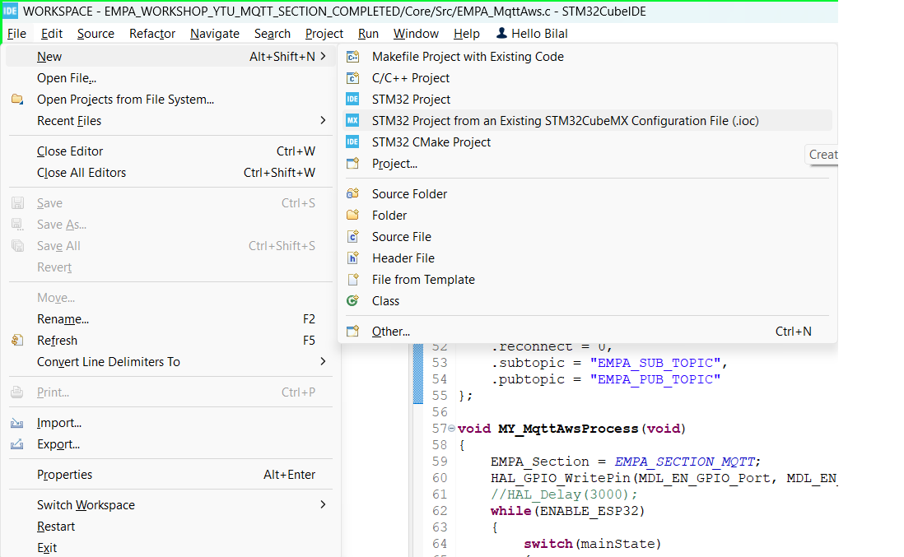
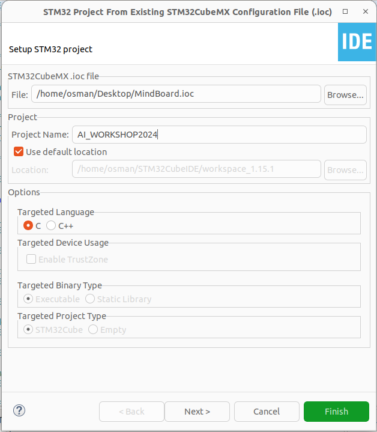
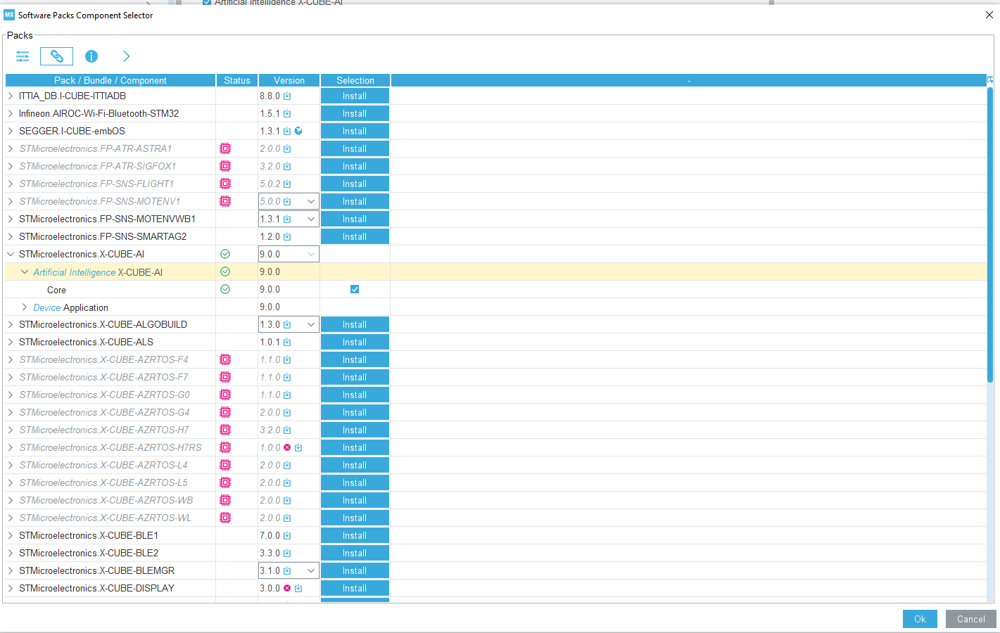
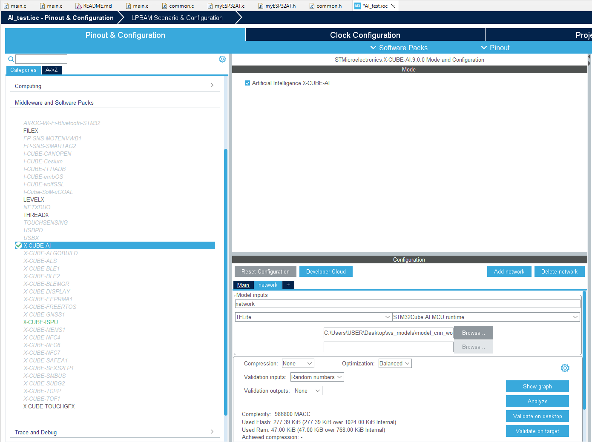
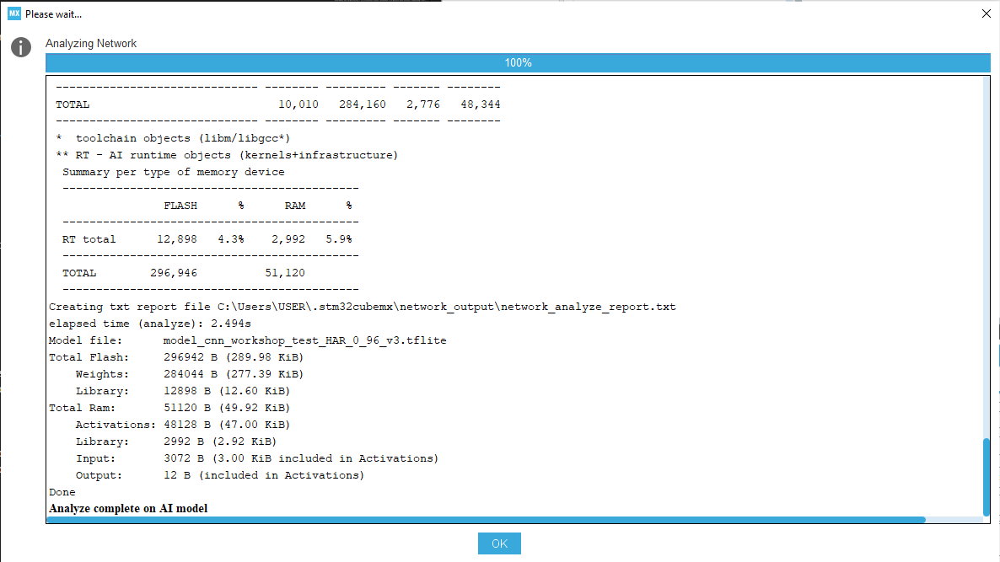

# STM32CubeAI Çıktısının MindBoard'a Implementasyonu
Öncelikle CubeAI uygulamamız için yeni bir proje açacağız. Bunu da STM32CubeIDE içerisinde File->New->STM32 Project from an Existing STM32CubeMX Configuration File (.ioc)'a tıklayın. 
<div align="center">
  
</div>
<br />
Ve ardından aşağıda gözüktüğü üzere indirmiş olduğunuz klasördeki CubeMX_Project_Files altında bulunan AI_Workshop.ioc dosyasını seçin ve projeyi isimlendirip işlemi tamamlamak için Finish'e basınız.
<div align="center">
  
</div>
<br />

Açılan IOC sayfasından yukarıda bulunan Software Packs->Select Component'a tıklayınız. Açılan pencereden X-CUBE-AI paketini açıp core seçeneğini aşağıdaki resimdeki gibi işaretleyiniz.

<div align="center">
  
</div>
<br />

"Ok" butonu ile IOC konfigurasyon sayfasına geri döndüğümüzde Middleware and Software Packs sekmesinde X-CUBE-AI seçeneğinin açıldığını göreceğiz. Bu seçeneğe tıkladığımızda Mode sekmesinde bulunan Artificial Intelligence seçeniğinin tikli olması gerekmektedir. Ardında
Aşağıda Configuration sekmesinde Main ve + simgesinin olduğunu göreceksiniz.
 
Burada + simgesine basıp yeni bir network oluşturabilirsiniz. Cube AI kullanılırken seçebileceğimiz 3 farklı model tipi vardır. TFLite, Keras ve ONNX. Prebuilt olarak repoda paylastığımız model bir TFLite modelidir, bu yüzden model olarak TFLite'yi seçip Browse ile kendi ürettiğiniz veya repoda hazır gelen modeli buraya ekleyiniz. Aşağıdaki Ayarlarla kontrol edebilirsiniz.

<div align="center">
  
</div>
<br />

IOC dosyasını savelemeden önce modelin Analizi yapılması gerekmektedir. Bunun için X-CUBE-AI Configuration sekmesinde bulunan Analyze düğmesine basınız. Aşağıdaki gibi bir analiz sonucu elde etmeniz gerekmektedir.

<div align="center">
  
</div>
<br />

Analiz tamamlandıktan sonra CTRL+S tuş kombinasyonuna basıp IOC dosyasının kod oluşturmasını sağlayabilirsiniz.

Ardından main.c içerisine gelerek aşağıdaki kodları gerekli yerlere ekleyiniz.

```c
/* USER CODE BEGIN Includes */

/* USER CODE END Includes */
```
yorum satırları arasına 
```c
#include <stdio.h>

#include "ai_platform.h"
#include "network.h"
#include "network_data.h"

#include "ism330is.h"
#include "custom_bus.h"
```

Gu kodları ekleyerek kullanacağımız kütüphaneleri main dosyamıza çekmiş olduk. Ardından:

```c
/* USER CODE BEGIN PV */

/* USER CODE END PV */
```
yorum satırları arasına 

```c
ai_handle network;
float aiInData[AI_NETWORK_IN_1_SIZE];
float aiOutData[AI_NETWORK_OUT_1_SIZE];
ai_u8 activations[AI_NETWORK_DATA_ACTIVATIONS_SIZE];
const char* activities[AI_NETWORK_OUT_1_SIZE] = {
  "CIRCLE", "HORIZONTAL", "STANDBY", "TRIANGLE", "VERTICAL"
};
ai_buffer * ai_input;
ai_buffer * ai_output;

ISM330IS_Object_t ism330_obj_o;
ISM330IS_IO_t ism330_ctx;
uint8_t ism330_id;
ISM330IS_Capabilities_t ism330_cap;
ISM330IS_Axes_t ism330_axes;
```
kodlarını ekleyerek kodda kullanacağımız global variablelar eklenmiş oldu. Sırası ile 

```c
/* USER CODE BEGIN PV */

/* USER CODE END PV */
```
yorum satırları arasına 
```c
static void AI_Init(void);
static void AI_Run(float *pIn, float *pOut);
static uint32_t argmax(const float * values, uint32_t len);
uint8_t ism330_sensor_init(void);
```

ve oluşturduğumuz prototip fonksiyonların tanımlarını

```c
/* USER CODE BEGIN 4 */

/* USER CODE END 4 */
```
içerisinde aşağıdaki gibi ekleyelim. Öncelikle Sensorümüzü initiliaze edebilmemiz için aşağıdaki fonksiyonu:

```c
uint8_t ism330_sensor_init(void) {
	ism330_ctx.BusType = ISM330IS_I2C_BUS;
	ism330_ctx.Address = ISM330IS_I2C_ADD_H;
	ism330_ctx.Init = BSP_I2C1_Init;
	ism330_ctx.DeInit = BSP_I2C1_DeInit;
	ism330_ctx.ReadReg = BSP_I2C1_ReadReg;
	ism330_ctx.WriteReg = BSP_I2C1_WriteReg;
	ism330_ctx.GetTick = BSP_GetTick;

	if (ISM330IS_RegisterBusIO(&ism330_obj_o, &ism330_ctx) != ISM330IS_OK)
		return 1;

	if (ISM330IS_ReadID(&ism330_obj_o, &ism330_id) != ISM330IS_OK)
		return 1;

	if (ism330_id != ISM330IS_ID)
		return 1;

	if (ISM330IS_Init(&ism330_obj_o) != ISM330IS_OK)
		return 1;

	if (ISM330IS_ACC_Enable(&ism330_obj_o) != ISM330IS_OK)
		return 1;

	if (ISM330IS_GYRO_Enable(&ism330_obj_o) != ISM330IS_OK)
		return 1;

	return 0;
}
```
AI Aktivasyonları ve networki hazırlmak için aşağıdaki init fonksiyonu:

```c
static void AI_Init(void)
{
  ai_error err;

  /* Create a local array with the addresses of the activations buffers */
  const ai_handle act_addr[] = { activations };
  /* Create an instance of the model */
  err = ai_network_create_and_init(&network, act_addr, NULL);
  if (err.type != AI_ERROR_NONE) {
    printf("ai_network_create error - type=%d code=%d\r\n", err.type, err.code);
    Error_Handler();
  }
  ai_input = ai_network_inputs_get(network, NULL);
  ai_output = ai_network_outputs_get(network, NULL);
}
```
Model için girişlerimizi ayarladıktan sonra modelli çalıştırması için Run fonksiyonu:

```c
static void AI_Run(float *pIn, float *pOut)
{
  ai_i32 batch;
  ai_error err;

  /* Update IO handlers with the data payload */
  ai_input[0].data = AI_HANDLE_PTR(pIn);
  ai_output[0].data = AI_HANDLE_PTR(pOut);

  batch = ai_network_run(network, ai_input, ai_output);
  if (batch != 1) {
    err = ai_network_get_error(network);
    printf("AI ai_network_run error - type=%d code=%d\r\n", err.type, err.code);
    Error_Handler();
  }
}
```
Son olarak Aktivasyonlar arasındaki en yüksek olasılığı bulması için argmax fonksiyonu
```c
static uint32_t argmax(const float * values, uint32_t len)
{
  float max_value = values[0];
  uint32_t max_index = 0;
  for (uint32_t i = 1; i < len; i++) {
    if (values[i] > max_value) {
      max_value = values[i];
      max_index = i;
    }
  }
  return max_index;
}
```

Printf fonksiyonun çalışması için 

```c
/* USER CODE BEGIN 0 */

/* USER CODE END 0 */
```
satırları arasına aşağıdaki fonksiyonu ekleyelim.
```c
int _write(int fd, char * ptr, int len)
{
  HAL_UART_Transmit(&huart1, (uint8_t *) ptr, len, HAL_MAX_DELAY);
  return len;
}
```

Main içerisinde Init fonksiyonları çağırmak için 

```c
 /* USER CODE BEGIN 2 */

/* USER CODE END 2 */
```

satırları arasına 

```c
  ism330_sensor_init();
  AI_Init();
```

Bu komutları ekleyelim.

AI_Run yapmadan önce oluşturduğumuz modelin girdileriniz bilmemiz gerekiyor. Prebuilt olarak verdiğimiz model 768 sample istemektedir. Bunların sırası accX[n] accY[n] accZ[n] gyroX[n] gyroY[n] gyro[n] şeklindedir. Bu yüzden While(1) içerisinde

```c
 /* USER CODE BEGIN WHILE */

  /* USER CODE END WHILE */
```
satırları arasına 
```c
  for(uint32_t i = 0; i < AI_NETWORK_IN_1_SIZE; i=i+6)
	  {
		  ISM330IS_ACC_GetAxes(&ism330_obj_o, &ism330_axes);
		  aiInData[i + 0] = ism330_axes.x;
		  aiInData[i + 1] = ism330_axes.y;
		  aiInData[i + 2] = ism330_axes.z;
		  ISM330IS_GYRO_GetAxes(&ism330_obj_o, &ism330_axes);
		  aiInData[i + 3] = ism330_axes.x/100;
		  aiInData[i + 4] = ism330_axes.y/100;
		  aiInData[i + 5] = ism330_axes.z/100;
		  HAL_Delay(8);
	  }
```
sensörden data toplama bölümünü oluşturalım. Bu kodun sonrasında aiInData içerisine girdilerimiz hazırladıktan sonra AIyı runlayabiliriz. Bunun için 

```c
 /* USER CODE BEGIN WHILE */

  /* USER CODE END WHILE */
```
satırları arasındaki veri topladıktan sonra

```c
AI_Run(aiInData, aiOutData);
```
kodunu ekleyelim. Çıktıları görmek için de Aşağıdaki kodları ekleyebiliriz.

```c
   /* Output results */
      for (uint32_t i = 0; i < AI_NETWORK_OUT_1_SIZE; i++) {
        printf("%8.6f ", aiOutData[i]);
      }
      uint32_t class = argmax(aiOutData, AI_NETWORK_OUT_1_SIZE);
      printf(": %d - %s\r\n", (int) class, activities[class]);
```

Kodumuz hazırdır, test etmek için kodu karta gömebiliriz.