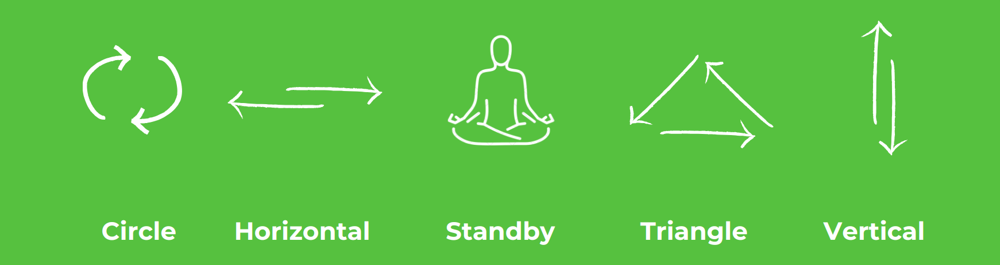

    

# 2) ST Platformları İçin Edge-AI Çözümleri Geliştirme
Empa Electronics tarafından düzenlenen Accelerators Workshops serimizin Uçta Yapay Zeka adımına hoşgeldiniz.  
Bu kılavuz, modern makine öğrenimi kütüphaneleri ve standart yaklaşımlarla geliştilecek "El Karakterleri Tanıma" uygulamamızın geliştirme adımlarında size rehberlik edecektir.

Aktivite içeriği olan "El Karakteri Tanıma" uygulaması,  workshop için Empa Electronics tarafından tasarlanmış ve üretilmiş Kafa Kart (_Mind Board_) kullanılarak gerçekleştirilecektir. Kart üzerindeki ivmeölçer ve jiroskop sensörlerinden alınan toplam 6 eksenli sensör ölçümleri, bir yapay zeka modeline girdi olarak kullanılacak ve uç birim (Kafa Kart) üzerinde 6 farklı el karakterini sınıflandırmak amacıyla kullanılacaktır. Kafa kartın elde tutulmasıyla gerçekleştirilecek el karakterleri görsel ile açıklanmıştır.

 

## Kurulum
Öncelikle, aşağıdaki bağlantıyı kullanarak çalışma ortamı kurulum adımlarını takip ediniz.
### ↳ [Çalışma Ortamı Kurulumu](Kurulum.md)
Aktivite için gerekli program ve gereçlerin kurulum adımlarını içerir.

## Uygulama
### ↳ [STM32 Platformları İçin Edge-AI Çözümleri Geliştirme: El Karakteri Sınıflandırma](Uygulama_train_hand_character_recognition.ipynb)
Aktivite içeriği olan "uçta yapay zeka" uygulamasının geliştirme adımlarını içerir.

### ↳ [Model Testi: El Karakteri Sınıflandırma](Uygulama_test_hand_character_recognition.ipynb)
Aktivite içeriği olan "uçta yapay zeka" uygulamasının test adımlarını içerir.

### ↳ [STM32CubeAI Çıktısının MindBoard'a Implementasyonu](Proje_Kurulum.md)
Aktivite içeriği olan "uçta yapay zeka" uygulamasının test adımlarını içerir.

## ST Platformlarında Uçta Yapay Zeka

**Tensorflow İle Makine Öğrenimi Modelleri Geliştirme**  
Tensorflow, beraberinde barındırdığı Keras kütüphanesinin de gücüyle, modern derin öğrenme / yapay zeka uygulamalarının geliştirilmesine olanak sağlayan en önemli açık kaynaklı geliştirme kaynaklarından biridir. Tensorflow kütüphanesi, yüksek-seviye kullanım dili ve bu sayede edindiği kullanım kolaylığı sebebiyle workshop etkinliği içerisinde geliştirilecek derin öğrenme modelinin temeli olarak tercih edilmiştir.

**STM32 Cube-AI İle Uçta Yapay Zeka Çözümleri Dağıtımı**  
Geliştirilen bir makine öğrenmesi/derin öğrenme modelinin bir uç birimde, ST platformlarında tesis edilmesi, STMicroelectronics tarafından geliştirilen STM32CubeAI dönüşüm aracı ile sağlanabilmektedir. STM32CubeAI, pek çok popüler model formatı desteği ve dahili olarak gelen model sıkıştırma/derleme araçlarıyla geliştirilen modellerin kolayca çözümleştirilebilmesine imkan tanımaktadır.

**Kaynaklar & Okuma Önerileri** 

1- [Tensorflow2 Quick Start for Beginners](https://www.tensorflow.org/tutorials/quickstart/beginner)

1- [STM32Cube.AI - A Free Tool For Edge-AI Developers](https://stm32ai.st.com/stm32-cube-ai/)