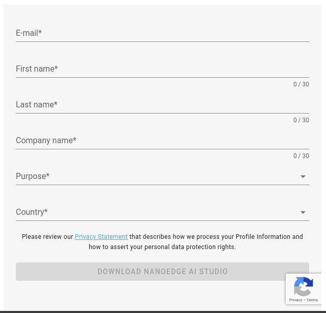
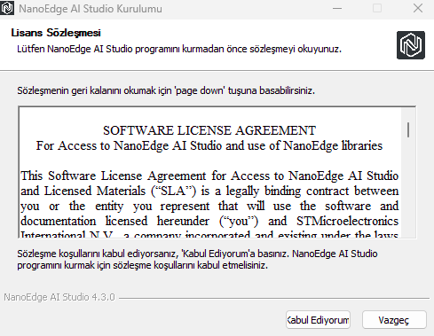
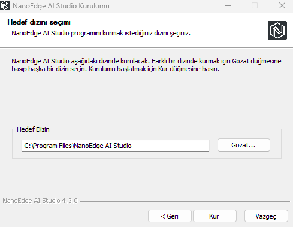
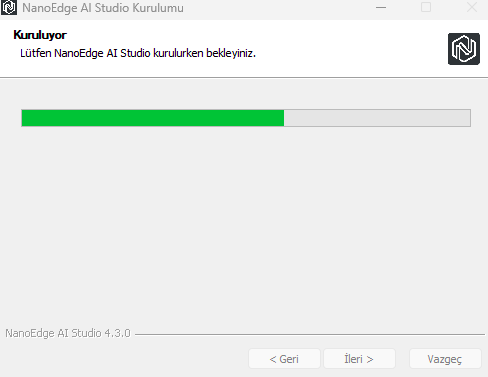
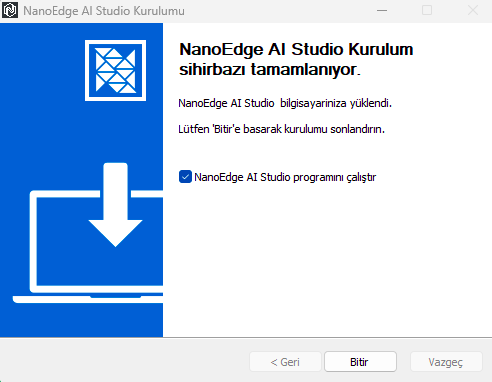
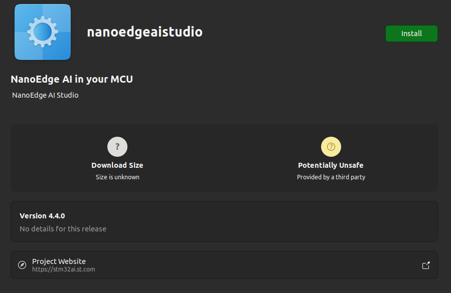
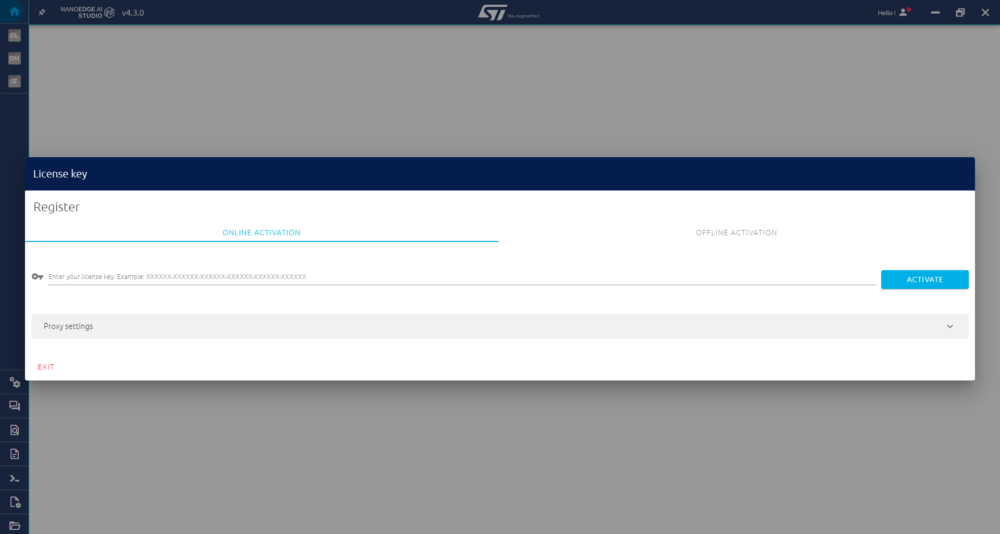

    

\
**Bu sayfada, NanoEdge AI Studio'nun Windows ve Ubuntu işletim sistemleri için kurulum adımlarını ele alacağız.**

## Kurulum

**Windows** ve **Ubuntu** için NEAIS aşağıdaki linkten indirilebilir.

**[https://stm32ai.st.com/download-nanoedgeai/](https://stm32ai.st.com/download-nanoedgeai/)**

**Form Doldurma**

Sitedeki formu doldurarak, kullanıcılar **indirme bağlantısı** ve **lisans anahtarına** e-postalarına gelen mailden ulaşabilir.

**NanoEdge AI Studio'yu Windows .exe Dosyası ile Kurma**

**NanoEdge AI Studio'yu Ubuntu .deb Dosyası ile Kurma**

- İndirilen .deb dosyasına sağ tıklayın,
- “**Yazılım Kur** ile Aç” seçeneğine tıklayın,
- **Kur** butonuna tıklayın.

**Lisans Anahtarı**

Kullanıcılar, **lisans anahtarlarını** aldıkları **e-posta**dan edinebilirler.

