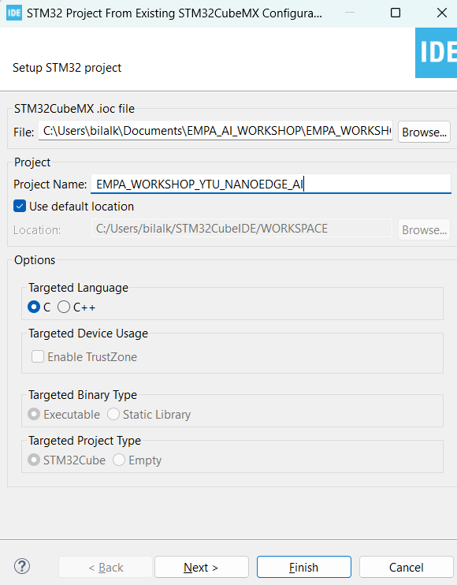
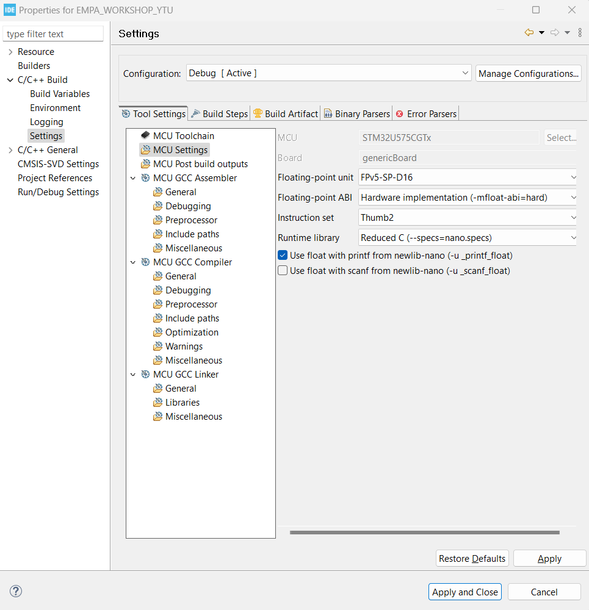
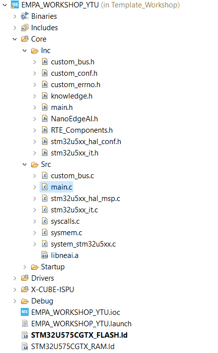
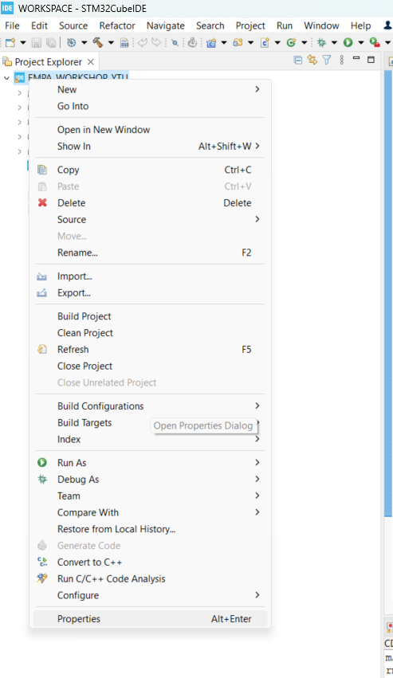
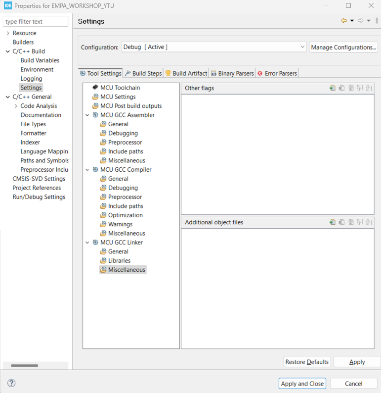
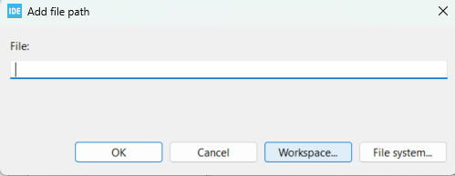
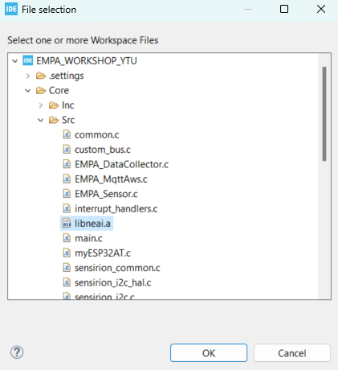

# NanoEdge AI Studio Çıktılarının Koda Eklenmesi

Öncelikle NanoEdge AI Studio uygulamamız için yeni bir proje açacağız. Bunu da STM32CubeIDE içerisinde File->New->STM32 Project from an Existing STM32CubeMX Configuration File (.ioc)'a tıklayın. 
<div align="center">
  
</div>
<br />

Ve ardından aşağıda gözüktüğü üzere indirmiş olduğunuz klasördeki EMPA_WORKSHOP_YTU.ioc dosyasını seçin ve ilerleyerek işlemi tamamlayın. 
<div align="center">
  
</div>
<br />
Burada .ioc dosyası içerisinde herhangi bir değişikllik yapmamıza gerek yoktur.

Ve ardından STM32CubeIDE programı içerisinde main.c dosyasına geçilir.<br />
<br />
Burada AI modelinin koda eklenmesinden önce anlık olarak sensör verilerini elde etmek için ISM330IS'ten verileri alabilmemiz gerekir. Bunun için sensor_process fonksiyonlarını eklememiz gerekir.<br />

Öncelikle 
```c
/* USER CODE BEGIN Includes */

/* USER CODE END Includes */
```
yorum satırları arasına 
```c
#include "ism330is.h"
#include "custom_bus.h"
```
yukarıdaki kütüphaneler eklenir.

Ardından 
```c
/* USER CODE BEGIN PV */

/* USER CODE END PV */
```
yorum satırları arasına 
```c
ISM330IS_Object_t ism330_obj_o;
ISM330IS_IO_t ism330_ctx;
uint8_t ism330_id;
ISM330IS_Capabilities_t ism330_cap;

typedef struct {
	int32_t x;
	int32_t y;
	int32_t z;
} acc;

typedef struct {
	int32_t x;
	int32_t y;
	int32_t z;
} gyro;

typedef struct {
	acc acc;
	gyro gyro;
} imu_data;
imu_data imu_sensor_data;
```
yukarıdaki kod satırları eklenir.

Sonrasında 
```c
/* USER CODE BEGIN PFP */

/* USER CODE END PFP */ 
```
yukarıdaki yorum satırları arasına 
```c
#ifdef __GNUC__
#define PUTCHAR_PROTOTYPE int __io_putchar(int ch)
#else
#define PUTCHAR_PROTOTYPE int fputc(int ch, FILE *f)
#endif

PUTCHAR_PROTOTYPE {
	HAL_UART_Transmit(&huart1, (uint8_t*) &ch, 1, HAL_MAX_DELAY);
	return ch;
}
uint8_t ism330_sensor_init(void);
uint8_t ism330_sensor_process(imu_data *sensor_data);
```
yukarıdaki kod satırları eklenir.
Ardından 
```c
/* USER CODE BEGIN 4 */

/* USER CODE END 4 */
```
arasına 
```c
uint8_t ism330_sensor_init(void) {
	ism330_ctx.BusType = ISM330IS_I2C_BUS;
	ism330_ctx.Address = ISM330IS_I2C_ADD_H;
	ism330_ctx.Init = BSP_I2C1_Init;
	ism330_ctx.DeInit = BSP_I2C1_DeInit;
	ism330_ctx.ReadReg = BSP_I2C1_ReadReg;
	ism330_ctx.WriteReg = BSP_I2C1_WriteReg;
	ism330_ctx.GetTick = BSP_GetTick;

	if (ISM330IS_RegisterBusIO(&ism330_obj_o, &ism330_ctx) != ISM330IS_OK)
		return 1;

	if (ISM330IS_ReadID(&ism330_obj_o, &ism330_id) != ISM330IS_OK)
		return 1;

	if (ism330_id != ISM330IS_ID)
		return 1;

	if (ISM330IS_Init(&ism330_obj_o) != ISM330IS_OK)
		return 1;

	if (ISM330IS_ACC_Enable(&ism330_obj_o) != ISM330IS_OK)
		return 1;

	if (ISM330IS_GYRO_Enable(&ism330_obj_o) != ISM330IS_OK)
		return 1;

	HAL_Delay(300);
	return 0;
}

uint8_t ism330_sensor_process(imu_data *sensor_data) {
	ISM330IS_Axes_t ism330_axes;
	if (ISM330IS_ACC_GetAxes(&ism330_obj_o, &ism330_axes) == 0) {
		sensor_data->acc.x = ism330_axes.x;
		sensor_data->acc.y = ism330_axes.y;
		sensor_data->acc.z = ism330_axes.z;
	} else
		return 1;

	if (ISM330IS_GYRO_GetAxes(&ism330_obj_o, &ism330_axes) == 0) {
		sensor_data->gyro.x = ism330_axes.x/100;
		sensor_data->gyro.y = ism330_axes.y/100;
		sensor_data->gyro.z = ism330_axes.z/100;
	} else
		return 1;
	return 0;
}
```
yukarıdaki fonksiyonlar eklenir.
Ve 
```c
	/* USER CODE BEGIN 2 */

	/* USER CODE END 2 */
```
yukarıdaki yorum satırları arasına 
  ```c
  ism330_sensor_init();
  ``` 
  fonksiyonu eklenir. Böylece sensörden veri alabilecek seviyeye gelmiş oluruz.

  Float değişkenlerin yazdırılabilmesi için proje ayarlarından "Use float with printf from newlib-nano (-u _print_float)  seçeneğinin seçilmesi gerekir.
  <div align="center">
  
</div>
<br />

  Bunu da yukarıdaki resimde gözüktüğü üzere Projeye sağ tıklayarak en altta bulunan Properties seçeneğini seçtikten sonra C/C++ Build->Settings->MCU Settings kısmından gerçekleştirebilirsiniz.


NanoEdge AI Studio ile hazırlanan .a ve .h dosya uzantılı model dosyalarının koda eklenmesi için öncelikle knowledge.h ve NanoEdgeAI.h dosyalarının Core->Inc klasörüne eklenmesi gereklidir.
Ardından libneai.a dosyasını da Core->Src klasörüne kopyalamamız gereklidir. 

Dosyalar aşağıdaki gibi eklenmiştir. 
<div align="center">
  
</div>
<br />

Öncelikle 
<div align="center">
  
</div>
<br />
yukarıdaki şekilde gösterildiği üzere proje dosyasına sağ tıklanır ve en alttaki Properties seçilir.

Ardından C/C++ Build sekmesinden Settings seçilir. 

<div align="center">
  
</div>
<br />
Ve yukarıdaki şekildeki gibi Tool Settings sekmesi altında MCU GCC Linker bölümünden Miscellaneous sekmesine girilir.
Burada Additional object files bölümünün yanındaki Add işaretine tıklanır. 

<div align="center">
  
</div>
<br />
Açılan ekranda Workspace... seçeneği seçilir.


<div align="center">
  
</div>
<br />
Ardından yukarıdaki şekildeki gözüken şekilde libneai.a dosyası seçilir.

Ok, Ok ve Apply and Close seçilir ve ekleme işlemi tamamlanmış olur. 

Ardından 

```c
/* USER CODE BEGIN Includes */

/* USER CODE END Includes */
```
yorum satırları arasına 
```c
#include "knowledge.h"
#include "NanoEdgeAI.h"
```
yukarıdaki kütüphaneler eklenir.
```c
/* USER CODE BEGIN PV */

/* USER CODE END PV */
```
yorum satırları arasına 

```c
uint16_t id_class = 0; // Sınıf kimliğini tutar
float input_user_buffer[DATA_INPUT_USER * AXIS_NUMBER]; // Giriş sinyalleri tamponu
float output_class_buffer[CLASS_NUMBER]; // Sınıf olasılıkları tamponu
const char *id2class[CLASS_NUMBER + 1] = { // Sınıf kimliğini sınıf adlarına eşler
    "unknown",
    "data_yurume",
    "data_kosma",
    "data_durma",
};
```
yukarıdaki kod satırlarını ekleyin.
Ardından  
```c
 /* USER CODE BEGIN 2 */

  /* USER CODE END 2 */
```
yorum satırlarının arasına 
```c
    enum neai_state state = neai_classification_init(knowledge);
    if (state != NEAI_OK) {
        printf("Initialization failed with error code: %d\n", state);
        return -1;
    }
```
yukarıdaki kod satırlarını ekleyin. <br />

Ve ardından while(1) içerisinde 
```c
	    for (int i = 0; i < DATA_INPUT_USER ; i++) {
	    	ism330_sensor_process(&imu_sensor_data);
	        input_user_buffer[AXIS_NUMBER*i] = (float)imu_sensor_data.acc.x; 
	        input_user_buffer[AXIS_NUMBER*i+1] = (float)imu_sensor_data.acc.y;
	        input_user_buffer[AXIS_NUMBER*i+2] = (float)imu_sensor_data.acc.z;
	        input_user_buffer[AXIS_NUMBER*i+3] = (float)imu_sensor_data.gyro.x;
	        input_user_buffer[AXIS_NUMBER*i+4] = (float)imu_sensor_data.gyro.y;
	        input_user_buffer[AXIS_NUMBER*i+5] =(float) imu_sensor_data.gyro.z;
	        HAL_Delay(8);
	    }
	    // Sinyal sınıflandırma işlemi
		state = neai_classification(input_user_buffer, output_class_buffer,
				&id_class);

		if (state == NEAI_OK) {
			printf("Classified as: %s\n", id2class[id_class]);
			
			printf("Class probabilities:\n");
			for (int i = 0; i < CLASS_NUMBER; i++) {
				printf("Class %s: %.2f%%\n", id2class[i + 1],
						output_class_buffer[i] * 100);
				HAL_Delay(300);
			}
		} else {
			printf("Classification failed with error code: %d\n", state);
		}
```
yukarıdaki kod satırlarını ekleyin. Yukarıdaki kod satırlarıyla beraber anlık olarak ivmeölçer ve jiroskop verileriyle durma, yürüme ve koşma aktivitelerinin sınıflandırılması gerçekleştirilip seri terminal aracılığıyla sınıflandırma sonucu gözlemlenecektir.