

    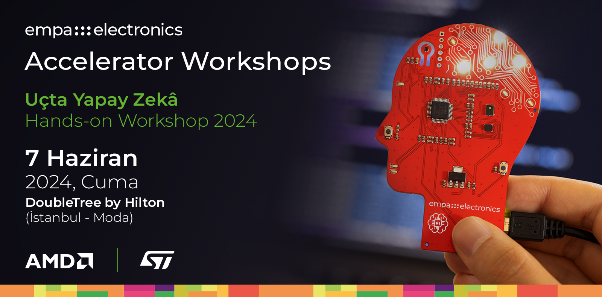

\
**Bu sayfada, NanoEdge AI Studio ile bir AI modeli geliştirmenin genel adımlarını inceleyeceğiz.**

## 1. Ön İşleme Süreçleri

NanoEdge AI Studio esas olarak **sensör** uygulamaları için yapılmıştır ve sensör uygulamaları **zaman serisi** verilerinden oluşur. Bu nedenle, kullanıcıların bu uygulamalar için uygun giriş verilerini kullanmaları gerekir, böylece modeller doğru bir şekilde oluşturulabilir.

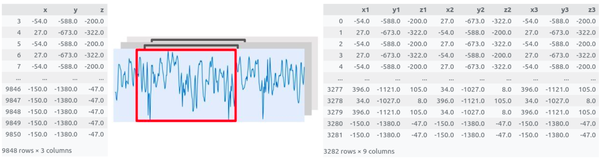

### 1.1. **Data Logger (DL)**

- USB portundan veri almak için **aşağıdaki yapılandırma seçenekleri** ile **veri toplamak için kullanıma hazır** bir .bin dosyası çıktısı verir.
    - Uyumlu **MCU listesi**,
    - Seçili MCU **sensörleri**,
    - Seçili MCU'ya özgü **parametreler** (her eksen için sample boyutu, sample hızı, veri aralığı, eksen sayısı, vb.).
- arasından seçilen kombinasyonlar ile veri toplamak için elde edilen .bin dosyası seçilen karta direkt olarak gömülebilir. (Bu görev için *STM32CubeProgrammer* kullanılabilir.)

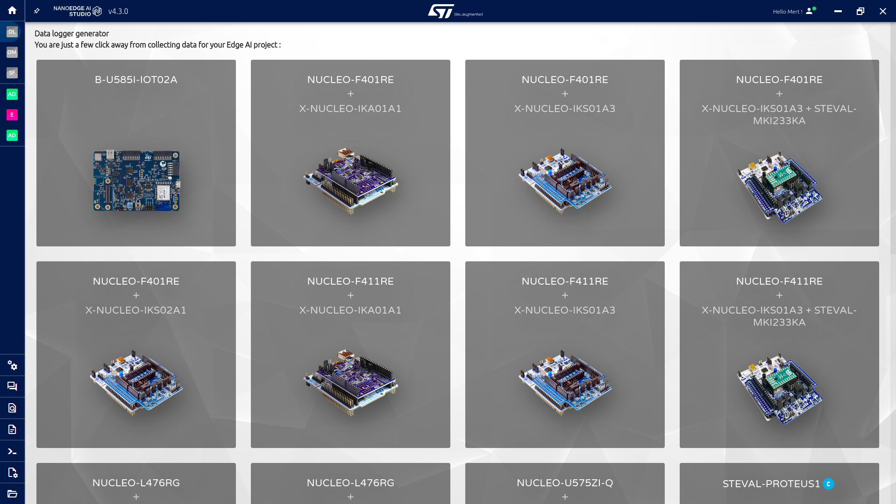

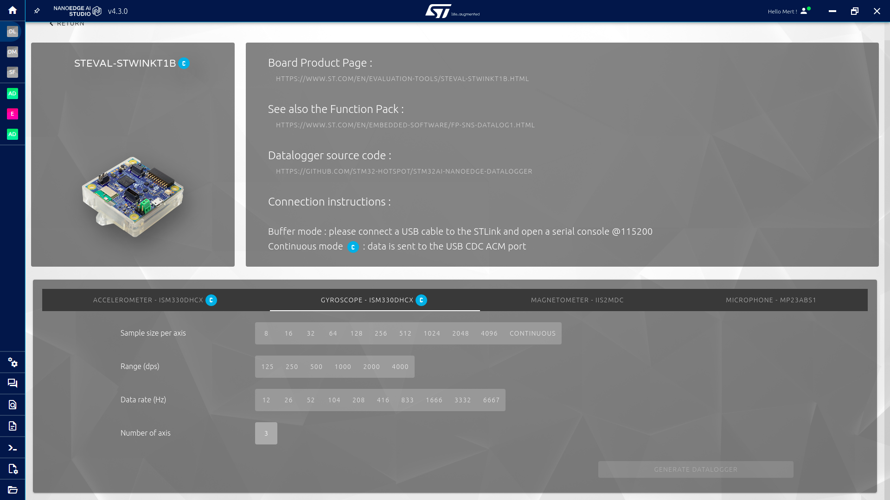

### 1.2. **Data Manipulation (DM)**

- Verilen veri setleri üzerinde seçili işlemleri uyguladıktan sonra veri dosyaları çıktısı verir.
    - Satırları **kaldır**,
    - Sütunları **kaldır**,
    - Sütun numaralarını değiştir (örn. **sampling**),
    - Satırları **karıştır**.

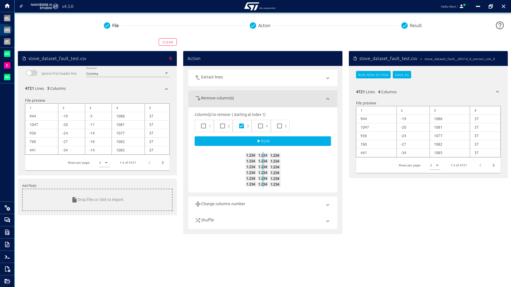

### 1.3. **Sampling Finder (SF)**

- **Aralıksız toplanan veriler** için, Sampling Finder en yüksek skoru korumayı amaçlar ve mümkün olan *en küçük* **örnekleme boyutu (sampling)** ve **örnekleme süresini** belirler.
- **Girdiler:**
    - Sınıflandırma dosyaları,
    - Kullanılan eksen sayısı,
    - Kullanılan örnekleme frekansı,
    - Test edilecek minimum frekans.

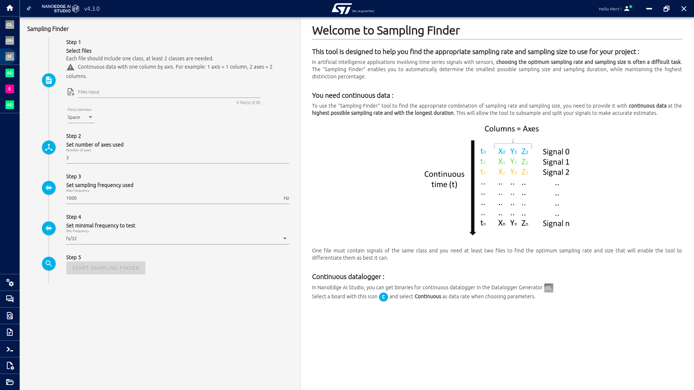

## 2. Modeller

### 2.1. **Anomaly Detection (AD)**

- Verilerde **anormallikleri tespit eder**,
- **Dinamik model** kullanır.
- **Dinamik modeller**, farklı kartlarda veya farklı koşullarda çalışmak için **uyum sağlama** yeteneği sunar. Bu, modelin kendini **uyarlamak** için **uçta tekrar eğitilme** yeteneğini getirir.
- NEAIS, **hedef MCU'da doğrudan öğrenen eğitimsiz bir model** çıktısı verir.

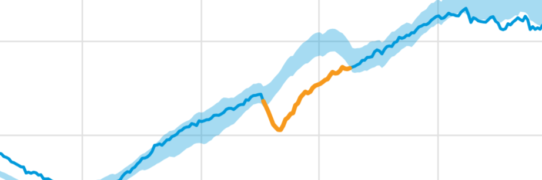

### 2.2. **1-Class Classification (1CC)**

- Verilerde **anormallikleri tespit eder**,
- **Statik** model kullanır.
- NEAIS, hedef MCU'da **yalnızca sonuç veren önceden eğitilmiş** aykırı değer tespit modeli çıktısı verir.

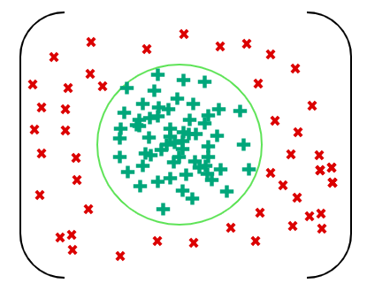

### 2.3. **n-Class Classification (nCC)**

- *n* farklı durumu **sınıflandırır**,
- **Statik** bir model kullanır,
- NEAIS, hedef MCU'da **yalnızca sonuç veren ve önceden eğitilmiş** sınıflandırma modeli çıktısı verir.

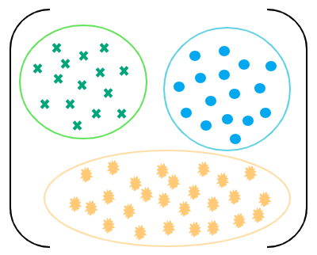

### 2.4. **Extrapolation (E)**

- Önceki uygulamaların aksine, bilinmeyen bir **hedef değeri** tahmin eder (diğer tüm uygulamalar **ayrık değerli** sınıf çıktısı verir),
- **Statik** bir model kullanır,
- Veri setinde etiketler bekler, USB girdilerini **kabul etmez**,
- NEAIS, hedef MCU'da **yalnızca sonuç veren veönceden eğitilmiş** regresyon modeli çıktısı verir.

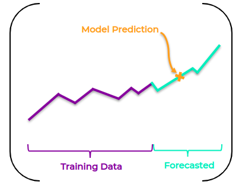

## 3. Uçtan Uca Geliştirme Adımları

NanoEdge AI Studio, sürecin hemen her kısmı için kullanıcılara **ipuçları** verir. İpuçlarını uygulayarak, kullanıcılar çıktı performansını önemli ölçüde artırabilir.

### 3.1. Proje Ayarları:

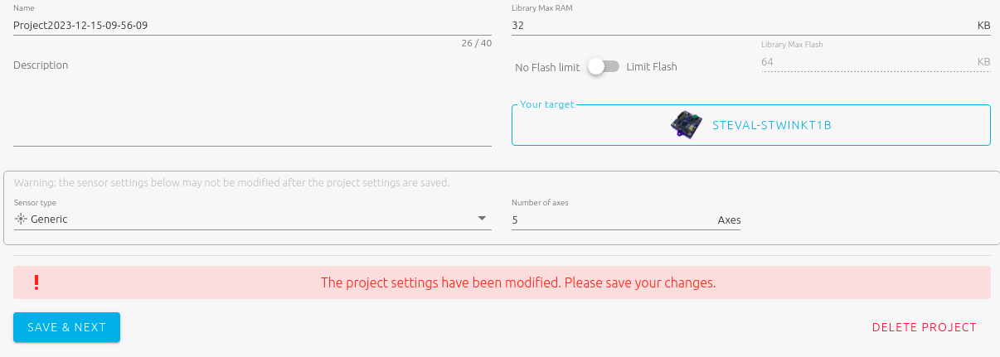

- **Target** Sensor Model - **Hedef** Sensör Modeli
    - Kullanıcı, AI modelini gömmek için hedef sensör modelini seçmelidir.
- **Sensor** **Type** - **Sensör** **Türü**
    - Akım, 1 Eksen
    - Mikrofon, 1 Eksen
    - İvmeölçer, 1-2-3 Eksen
    - Hall Sensörü, 1-2-3 Eksen
    - Generic:
        - Sensör türü yukarıdaki listede yoksa veya birden fazla sensör kullanılıyorsa, kullanıcılar **generic** seçeneğini seçmelidir.
    - Multisensor:
        - **Sadece anomali tespit projelerinde**, Multisensor seçeneği, tipik olarak zaman içinde yavaşça değişen makine durumlarını izlemek için kullanılır. Bu durumlar, **farklı sensör kaynaklarından** gelen değişkenlerle ve/veya sinyal bufferlarının yapay, üst düzey özelliklere dönüştürülmesiyle elde edilebilir.
- **Number of Axes / Variables** - **Eksen / Değişken Sayısı**
    - **ÖNEMLİ:** NEAIS, sütun sayısını eksen sayısına bölerek veride kullanılan örnek sayısını kontrol eder. (Örneğin, 3 eksen ivmeölçer ve 3 eksen jiroskop veri toplamak için kullanılıyor ise ve veri 128 adet okumayı kullanılarak örneklendirildiyse, bir satır veri 128 örnek * 6 eksen = 768 sütundan oluşur.)
    - Bu seçenek, Sensör Türü Generic veya Multisensor değilse pasif olacak gözükecektir.
- Modelin (Kütüphanenin) **maksimum RAM** & **maksimum Flash** değerleri.
    

### 3.2. Sinyaller:

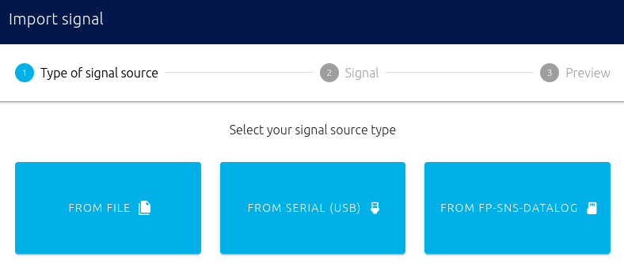

- **From File** - **Dosya ile**
    - Her sınıf için farklı veri dosyaları seçilir.
    
    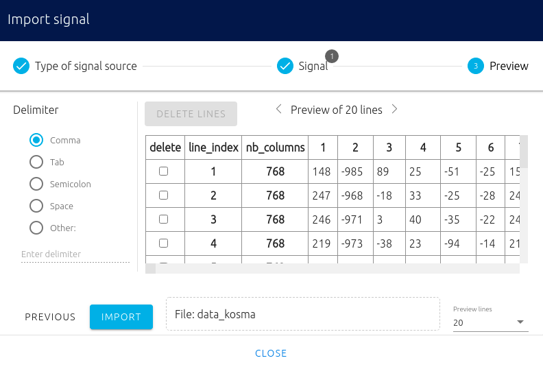
    
    - Dosyaları seçtikten sonra veri setleri görülebilir. Eğer **veri uygun değilse**, NanoEdge AI Studio uygun olmayan kısımları vurgular ve kullanıcıdan sorunları düzeltmesini ister.

- **Seri Port (USB) Üzerinden:**
    - Veriler doğrudan USB'den alınır.

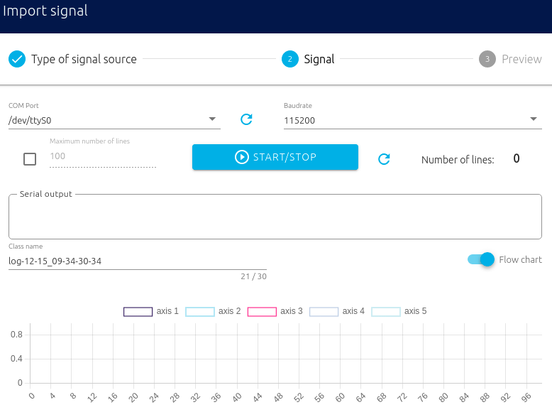

- **SD Karttan**
    - Şu an için, SD Kart seçeneği sadece **From File** seçeneği ile yapılabilir durumda.

**Veriyi içe aktardıktan sonra:**

- Eksenler, verinin sütunlarıdır (features).
- Veri uygunsa, NanoEdge AI Studio verilere **Fourier Dönüşümü** uygular, böylece sinyaller Frekans Domain'inde görülebilir.

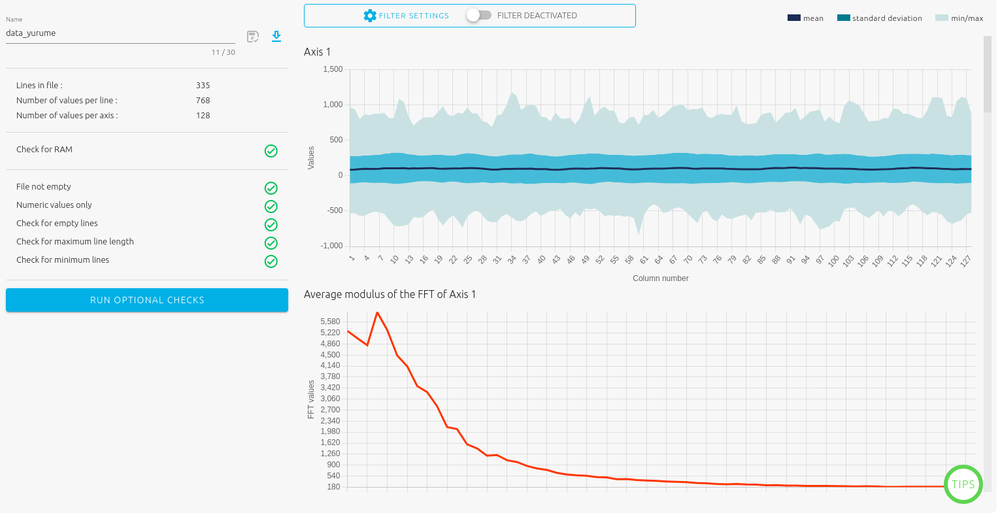

- Kullanıcı giriş sinyallerinden **istenmeyen frekans** bileşenlerini **kaldırmak** istiyorsa, **Filtre**yi açabilir. Sinyalleri belirli bir frekans penceresine sınırlandırmak için kesilecek frekansları seçebilir.

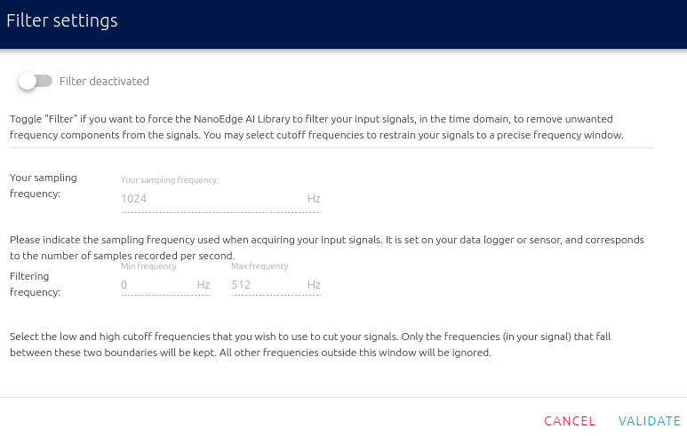

### 3.3. Benchmark (Model Eğitimi ve Performansı)

Bu bölümde, **seçili sinyaller (sınıflar)** ve **benchmark için kullanılacak CPU çekirdek sayısı** seçenekleri işaretlenerek  benchmark başlatılabilir.

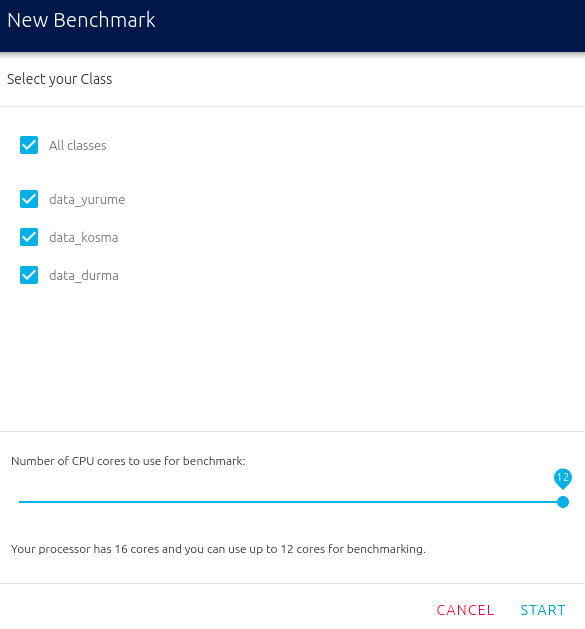

**Bu pencerede, seçilecek her veri ayrı bir sınıf olarak kabul edilir!**

Başlat düğmesine tıkladıktan birkaç saniye sonra benchmark başlayacaktır.

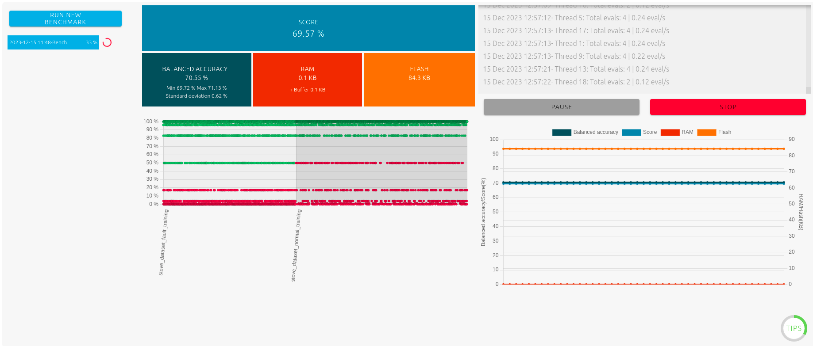

Benchmark ekranında kullanıcı şunları görür:
- Benchmark'ın **durumu**,
- Benchmark'ın **ilerlemesi** ve zaman etiketleri,
- **Performans** göstergeleri,
- **Log** penceresi (Benchmark durumu, çekirdek başına arama hızı, bulunan yeni kütüphaneler, vb.),
- Zaman içinde **performansın gelişimi**,
- **Duraklat** ve **Durdur** düğmeleri.

Benchmark'tan sonra, kullanıcılar eğitilen tüm kütüphanelerden birini **seçme** seçeneğine sahiptir. Bunun amacı farklı performans öncelikleri olan kullanıcıların isteklerine uygun modelleri seçmelerini sağlamaktır.

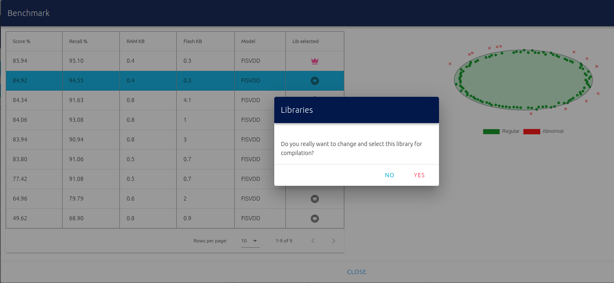

### 3.4. Validation - Doğrulama

Kullanıcılar test verilerini kullanarak modelleri **karşılaştırabilir** ve **tercih edilen modeli seçebilir**.

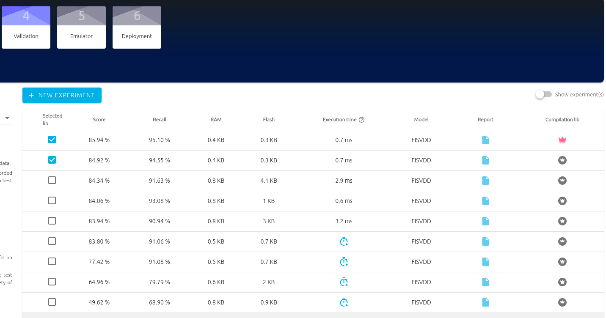

### 3.5. Emulator

Modeli **doğrudan NanoEdge AI Studio içinde emüle etmeyi** sağlar.

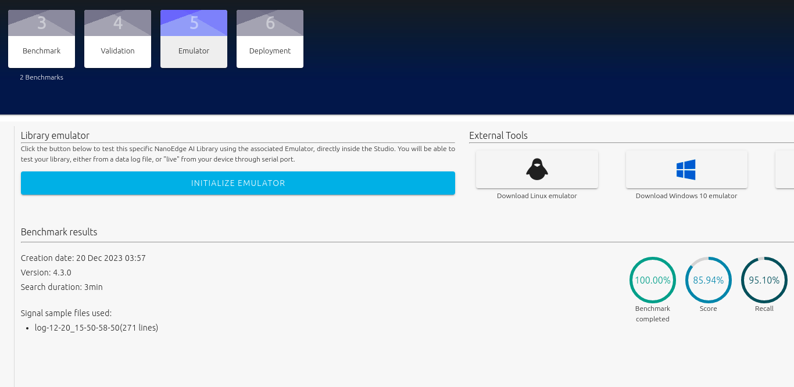

### 3.6. Deployment - Model Kütüphanesi Elde Etme

- Kullanıcılar, **eğitilmiş model kütüphanesini** ve C kodu örneklerini **Compile Library (kütüphaneyi derle)** düğmesi ile bilgisayarlarına kaydedebilirler.
- Ekranın sağında bulunan kod örneği, modeli hedef MCU'da kullanmak için bir kılavuz görevi görür.

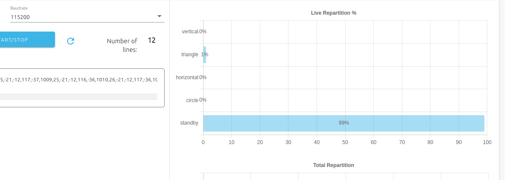
